<h3><code>nithin@github ~ $ ./contributions.sh</code></h3>

  

<h3><code>nithin@github ~ $ whoami</code></h3>

<table>
  <tr>
    <td valign="top"></td>
    <td valign="top"></td>
  </tr>
</table>

<a href="https://sainithingoud.vercel.app">Portfolio</a> ·
<a href="https://linkedin.com/in/sainithingoudk">LinkedIn</a> ·
<a href="mailto:sainithingoudk@gmail.com">Email</a>

