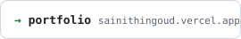

<picture><source media="(prefers-color-scheme: dark)" srcset="./assets/header-dark.svg" /></picture> 
<picture><source media="(prefers-color-scheme: dark)" srcset="./assets/contrib-3d-dark.svg" /></picture> 
<picture><source media="(prefers-color-scheme: dark)" srcset="./assets/about-dark.svg" /></picture> 
<a href="https://sainithingoud.vercel.app"><picture><source media="(prefers-color-scheme: dark)" srcset="./assets/btn-portfolio-dark.svg" /></picture></a>
<a href="https://linkedin.com/in/sainithingoudk"><picture><source media="(prefers-color-scheme: dark)" srcset="./assets/btn-linkedin-dark.svg" /></picture></a>
<a href="mailto:sainithingoudk@gmail.com"><picture><source media="(prefers-color-scheme: dark)" srcset="./assets/btn-email-dark.svg" /></picture></a> 
<picture><source media="(prefers-color-scheme: dark)" srcset="./assets/footer-dark.svg" /></picture>

