<picture>
  <source media="(prefers-color-scheme: dark)" srcset="./assets/header-dark.svg" />
  
</picture>

  

<picture>
  <source media="(prefers-color-scheme: dark)" srcset="./assets/contrib-heatmap-dark.svg" />
  
</picture>

<picture>
  <source media="(prefers-color-scheme: dark)" srcset="./assets/pacman-dark.svg" />
  
</picture>

  

<table>
  <tr>
    <td valign="top">
      <picture>
        <source media="(prefers-color-scheme: dark)" srcset="./assets/ascii-portrait-dark.svg" />
        
      </picture>
    </td>
    <td valign="top">
      <picture>
        <source media="(prefers-color-scheme: dark)" srcset="./assets/info-card-dark.svg" />
        
      </picture>
    </td>
  </tr>
</table>

<picture>
  <source media="(prefers-color-scheme: dark)" srcset="./assets/projects-dark.svg" />
  
</picture>

<a href="https://github.com/NithinGoud2605/Finance-Application">finorn</a> ·
<a href="https://github.com/NithinGoud2605/Savebucks">savebucks</a> ·
<a href="https://github.com/NithinGoud2605/AI-Resume-Evaluator">ai-resume-evaluator</a> ·
<a href="https://github.com/NithinGoud2605/MoneyScale">moneyscale</a> ·
<a href="https://github.com/NithinGoud2605/cf_ai_SaiNithinGoudK">cf-ai-chat</a>

  

<table>
  <tr>
    <td valign="top">
      <picture>
        <source media="(prefers-color-scheme: dark)" srcset="./assets/now-dark.svg" />
        
      </picture>
    </td>
    <td valign="top">
      <picture>
        <source media="(prefers-color-scheme: dark)" srcset="./assets/timeline-dark.svg" />
        
      </picture>
    </td>
  </tr>
</table>

<a href="https://sainithingoud.vercel.app"><picture><source media="(prefers-color-scheme: dark)" srcset="./assets/btn-portfolio-dark.svg" /></picture></a>
<a href="https://linkedin.com/in/sainithingoudk"><picture><source media="(prefers-color-scheme: dark)" srcset="./assets/btn-linkedin-dark.svg" /></picture></a>
<a href="mailto:sainithingoudk@gmail.com"><picture><source media="(prefers-color-scheme: dark)" srcset="./assets/btn-email-dark.svg" /></picture></a>

  

<picture>
  <source media="(prefers-color-scheme: dark)" srcset="./assets/footer-dark.svg" />
  
</picture>

